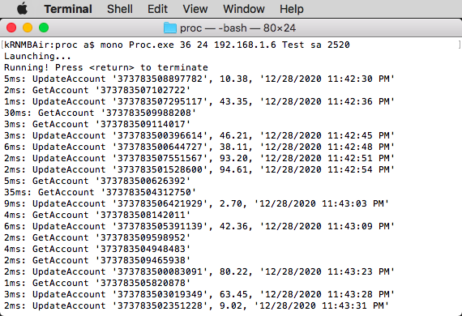
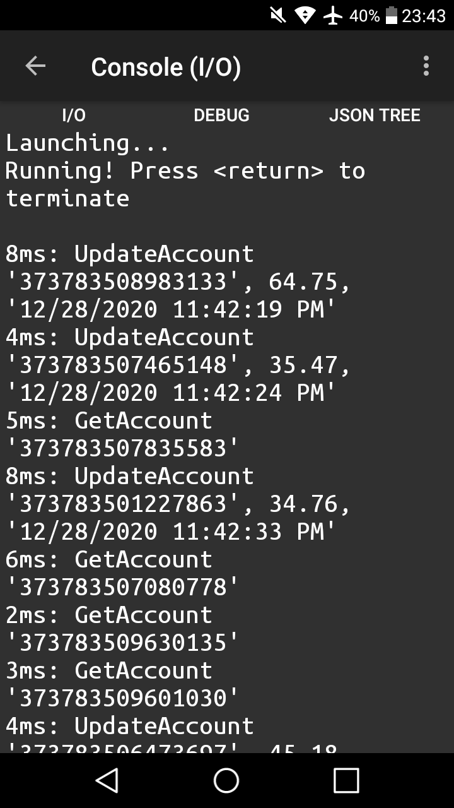

## dbAnimator
An open-source software testing tool for simulating multi-client transactional pressure against a database server.

The tool is intentionally minimal. It can be customized to any variety or mix of dynamic workload, whether stored procedures or SQL. It can target multiple servers and it can run on multiple platforms.

---


#### What's New

The original VB6 version is now converted to VB16 and C#. Operation is similar and everything remains customizable. A number of enhancements were back-ported to VB6 to maintain branch parity.

This new release contains four independent branches which create sizable testing workloads against a database server. Select from three Windows applications (built with C#, Visual Basic 16, and the venerable VB6) or use the C# console application (which is compatible with Mono and can run on MacOS, Linux, Docker, or Windows).

See the wiki in this repository for operational tips.


#### Concept

When a database management system such as SQL Server is installed on a particular hardware configuration, it is often necessary to test the system's ability to handle transactional traffic as part of planning for future growth. Multiple questions arise: Will the environment scale? What needs to be tuned? Where are the bottlenecks?

Over twenty-five years ago, while consulting on database performance and optimization, I developed a simple tool using Visual Basic to run some test transactions for a customer. Over time, this tool evolved through several iterations and was eventually released as *Database Hammer* in the SQL Server 2000 Resource Kit.

Now, at version 7, the default operation remains staightforward: 1) create a test database containing one table, 2) install 10 million rows of data, 3) run multiple clients that perform a mix of queries and updates against the test data. While the workload is underway, metrics can be observed and recorded.

Each of the branches in this new release contains two modules: a "Load" module which builds a 10 million row table, and a "Proc" module which runs transactional work on the server. All of the branches are multithreaded to spread the workload, and multiple Procs can run on several client machines.

Although the framework to communicate with Microsoft SQL Server is the default, additional database server protocol could be implemented.


#### Release 7.0 Overview

##### CSharp Branch

        C# version - Visual Studio
        Windows Forms App (.NET Framework 4)
    
##### VB16 Branch

        Visual Basic 16 version - Visual Studio
        Windows Forms App (.NET Framework 4)

##### CSharp-console Branch

        C# cross-platform version  - Visual Studio
        Console App (.NET Framework 4)
        Compatible with Mono

##### VB6 Branch

        Visual Basic 6.0 legacy version updated for 2021
        [*] fix update transaction amount to whole cents;
        [+] convert stats page to ListView and add copy button;
        [+] add timer to stats page for periodic refresh
        [+] darken UI of the Load component to distinguish from Proc;
        [+] install state machine;
        [+] ramp termination;
        [+] visual notice at completion of Load;
        [*] correct 0-999999 error;
        [*] limit number of connections to 999;
        [*] add pacing of launch in Proc and Load;
        [*] unload visible stats page on shutdown;
        [+] rename main and worker modules;
        [+] update documentation;


---

### C# and VB16 build and operations

The Windows Forms Application versions in C# and VB16 are similar in setup and operation.

#### Setup

Create a test database. See the SQL directory for sample scripts such as *Createdb.txt*
Set recovery to SIMPLE.

#### Load

Next, go into the Load folder, build the solution with Visual Studio, and run the resulting Load.exe. Something similar to the following should appear on the screen:<br>
<br>

By default, the Load application is designed to run 100 threads with each one inserting 100,000 rows into a test table. This can be modified inside the app with care. The default interval specifies the amount of time to wait between row insertions. This can be adjusted up or down (to a minimum of 16 milliseconds). Be sure to specify the server and database names, and adjust the user ID and password accordingly. The defaults can be adjusted within the application's form fields.

The Start button will initiate the connection to the server database and load the test data. The load process can be paused or resumed. The interval can be adjusted when paused. Test runs indicate a duration of about 47 minutes for the load, but timing may vary due to a number of factors. As threads complete their work, the number of running threads will decrement until 0 when all 10M rows are loaded. The app can then be closed.

The final stage of the load process is set the database recovery mode back to FULL. Create the stored procedures. See *StoredProcs.txt* in the SQL directory.


#### Proc

After loading the data, go into the Proc folder, build the solution, and run the resulting Proc.exe. Something similar to the following should appear on the screen (depending on system color settings):<br>
<br>

By default, the Proc application will run 10 threads with each one performing a 50-50 mix of query and update operations in the 10 million row test table. Client statistics may be displayed and copied to the clipboard if desired. More often, server activity is observed using Performance Monitor or SQL Server Management Studio.

Transaction processing can be paused or resumed.

---

### C# console build and operations

The console version can be built with Visual Studio and run using Mono. See mono-project.com for information on downloading Mono for MacOS, Linux, Docker, and Windows.

#### Setup

Create a test database. See the SQL directory for sample scripts such as *Createdb.txt*
Create the stored procedures. Set recovery to SIMPLE.

#### Load

Next, go into the Load folder, build the solution with Visual Studio, and run the resulting Load.exe. Without parameters, a usage response is presented similar to:

        Usage: load instanceCount interval(ms) server dbname uid pwd
        Recommend: instanceCount=100 interval(ms)=28

By default, the Load application is designed to run 100 threads with each one inserting 100,000 rows into a test table. This can be modified inside the app with care. The default interval specifies the amount of time to wait between row insertions. This can be adjusted up or down (to a minimum of 16 milliseconds). Be sure to specify the server and database names, and provide the user ID and password accordingly.

With the correct parameters, the load process will echo thread 0 progress to the console. The main thread will monitor the running thread count until all are complete. Test runs indicate a duration of about 47 minutes for the load, but timing may vary due to a number of factors.

The final stage of the load process is set the database recovery mode back to FULL.

#### Proc

After loading the data, go into the Proc folder, build the solution, and run the resulting Proc.exe. Without parameters, something similar to the following should appear on the screen 

        Usage: proc instanceCount interval(ms) server dbname uid pwd
        Example: proc 36 24 Node77 Test sa 1234

or with Mono:

        mono Proc.exe instanceCount interval(ms) server dbname uid pwd
        Example: mono Proc.exe 36 24 Node77 Test sa 1234

With the correct parameters, the Proc application will run the specified number of threads with each one performing a 50-50 mix of query and update operations in the 10 million row test table. By default, every 100th command in thread 0 is echoed to the console with the response time in milliseconds. Transaction processing cannot be paused or resumed. Server activity can be observed using Performance Monitor or SQL Server Management Studio. Pressing the &lt;return&gt; key will terminate processing.

Below are screenshots of dbAnimate running on MacOS, and for additional proof of portability, also running on an Android phone (using the [C# Shell](https://play.google.com/store/apps/details?id=com.radinc.csharpshell&hl=en_US&gl=US>) app).





---

### VB6 build and operations

The following documentation is updated from the v6.1 release in the Microsoft SQL Server 2000 Resource Kit.

---

#### Setup

<br>
First step is to run the above script which creates a database and a testing table. It also sets the recovery mode to SIMPLE in preparation for data loading.


#### LoadMain


<br>
The second step is to run LoadMain which creates multiple LoadWork units. In total, these insert 10 million rows of test data into the sample table. Of course, this can be customized. Note, the LoadWork executable (below) will need to be created first, then a reference can be set in LoadMain.

#### LoadWork


<br>

Multiple LoadWork units allow for shorter data load duration. The LoadMain and LoadWork code is a variant of the ProcMain and ProcWork code. It is hardwired for 100 work units, each loading 100,000 rows. Of course, this can be changed, with care.

<br>
The final and important step is to create the stored procedures and set the data recovery mode to FULL. The stored procedures do the work of selecting or updating data. All of this is customizable.

---

#### ProcMain


<br>

ProcMain creates instances of ProcWork and displays statistics about the units in operation.

#### ProcWork


<br>

ProcWork initializes a class, creates a form instance and then awaits commands from the main unit process. ProcMain makes calls to ProcWork to initiate the timer to begin independent testing (not relying on Main). At any time, ProcMain can call ProcWork and inquire on the statistics of its present operations.

ProcWork manages statistics about the operation. It calls a kernel function named GetTickCount in order to keep track of how long it takes to execute one command. ProcWork maintains current response time as well as min, max, and average response time.

__Type of work done by the work units__<br>
This is totally customizable. In the supplied code, please note the procedure `GetCommand` in the
`ProcWorkClass.cls` class module is what decides the type of work to be done:
For example:
```vb
  If Rnd > 0.5 Then ' 50% of the time do a SELECT, otherwise do an UPDATE
    GetCommand = "GetAccount '37378350" & sCardNo & "'"
  Else
    GetCommand = "UpdateAccount '37378350" & sCardNo & "', " & _
        Trim(Str(CCur(Rnd() * 100))) & ", '" & Now & "'"
  End If
```
Notice that 50% of the time, this procedure returns a select (or GetAccount) command and the other time it returns an update (UpdateAccount). This can be customized. For example, consider a more complex command pattern such as 10% update, 35% insert, and 55% select.

__Compilation and Operation__<br>
Using the VB6 programming environment, compile and register the ProcWork executable. Then, open ProcMain, make reference to ProcWork, and compile the ProcMain exe. (See: https://winworldpc.com/product/microsoft-visual-bas/60)

When the ProcMain exe is run, a window similar to the following should appear:<br>


Change the server name and database name to the operating environment, or set them in the code. The start button will create a number of instances of ProcWork. Each ProcWork unit makes calls to the database based on the interval specified. After Start, the process can be paused or resumed. Statistics are also available.

__Potential Error__<br>
The following error occurs if the stored procedures were not loaded on the server.<br>


__Statistics__<br>
ProcMain displays client-side response time statistics (current, min, average, and max) from each ProcWork unit.<br>
<br>
<br>
On the server, use Performance Monitor to collect statistics such as Transactions/sec.<br>


---

#### 25-Year Version History

**20201226:** v7.0: New version release: VB6, C#, VB16, and C# console; renamed *dbAnimator*. <br>
**20201125:** New branch under development: C# cross-platform <br>
**20191214:** Updated branch under development: VB6 <br>
**20190314:** New branch under development: C# <br>
**20190214:** New version under development: VB16 <br>
*-------------- eighteen years pass --------------* <br>
**20010328:** Microsoft Press publishes SQL Server 2000 Resource Kit which included *Database Hammer* in the ToolsAndSamples folder on the companion CD.<br>
**20010119:** v6.1: Minor UI adjustments completed for release. <br>
**20001113:** Submission for packaging within SQL Server 2000 Resource Kit <br>
**20000706:** v6.0: To reduce transaction response time, modified to use stored procedures (per recommendation from Badriddine Khessib). Clients ask for a copy. The tool is used by members of our test team in Redmond to generate loads for enterprise clients. <br>
**20000615:** v5.0: Further development to increase number of connections; renamed *Database Hammer*. <br>
**20000321:** v4.0: Updated SQLLoader (with Enterprise Apps in Redmond)
    Intial development into a new multi-threaded version to load data and process a mix of transactions.<br>
**19981115:** v3.0: Renamed to SQLLoader in VB6 (with MCS) to run simulated credit card transactions like SQL Load Simulator. <br>
**19971120:** v2.0: Renamed to SQL Transaction Injector in VB5 and updated to simulate hotel transactions: checkin, restaurant purchase, folio updates, interface activity, message posts, miscellaneous, checkout for our client, Anasazi. <br>
**19951018:** v1.0: During my tenure as a database performance consultant with Microsoft Consulting Services in Phoenix, I wrote a Stress Simulation Program in VB4 called *crisptst* to run transactions and stress tests against SQL Server for our client, First Interstate Bank.

//EOF